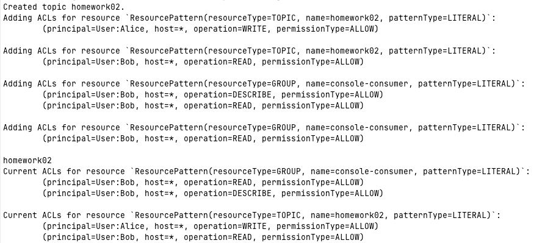
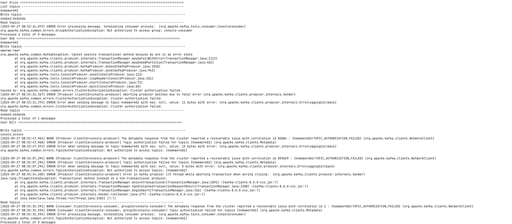

# Домашнее задание
kraft и kafka. Настройка безопасности

## Цель:
Научиться разворачивать kafka с помощью kraft и самостоятельно настраивать безопасность.


## Описание/Пошаговая инструкция выполнения домашнего задания:
Развернуть Kafka с Kraft и настроить безопасность:

## Запустить Kafka с Kraft:
* Сгенерировать UUID кластера +
* Отформатировать папки для журналов +
* Запустить брокер +
* Настроить аутентификацию SASL/PLAIN. + 
* Создать трёх пользователей с произвольными именами. +
* Настроить авторизацию. +
* Создать топик.
* Первому пользователю выдать права на запись в этот топик. 
* Второму пользователю выдать права на чтение этого топика. 
* Третьему пользователю не выдавать никаких прав на этот топик.
* От имени каждого пользователя выполнить команды:
  - Получить список топиков
  - Записать сообщения в топик
  - Прочитать сообщения из топика

В качестве результата ДЗ прислать документ с 
* описанием настроек кластера, 
* выполненных команд 
* снимков экрана с результатами команд.

Дополнительное задание: настроить SSL

# Решение 

## генерация Cluster_id
```shell
make cluster-id
```
## Запускаем kafka
```shell
make up
```

## Указываем конфигурации пользователей
```properties
TOPIC_NAME=homework2
ADMIN_CONFIG=/etc/kafka/secrets/admin-sasl.properties
ALICE_CONFIG=/etc/kafka/secrets/alice-sasl.properties
BOB_CONFIG=/etc/kafka/secrets/bob-sasl.properties
BILL_CONFIG=/etc/kafka/secrets/bill-sasl.properties
KAFKA_OPTS=--bootstrap-server $BOOTSTRAP_SERVER
```
Настраиваем переменные окружения
```shell
 source .env
```
## Создание топика, выдача прав
```shell create-grant.sh
docker exec kafka-broker kafka-topics --bootstrap-server $BOOTSTRAP_SERVER --command-config $ADMIN_CONFIG --create --topic $TOPIC_NAME
docker exec kafka-broker kafka-acls   --bootstrap-server $BOOTSTRAP_SERVER --command-config $ADMIN_CONFIG --add --allow-principal User:Alice --operation WRITE --topic $TOPIC_NAME
docker exec kafka-broker kafka-acls   --bootstrap-server $BOOTSTRAP_SERVER --command-config $ADMIN_CONFIG --add --allow-principal User:Bob   --operation READ  --topic $TOPIC_NAME
docker exec kafka-broker kafka-acls   --bootstrap-server $BOOTSTRAP_SERVER --command-config $ADMIN_CONFIG --add --allow-principal User:Bob   --operation READ  --operation DESCRIBE --group console-consumer
docker exec kafka-broker kafka-acls   --bootstrap-server $BOOTSTRAP_SERVER --command-config $ADMIN_CONFIG --add --allow-principal User:Bob   --operation READ  --group console-consumer
docker exec kafka-broker kafka-topics --bootstrap-server $BOOTSTRAP_SERVER --command-config $ADMIN_CONFIG --list
docker exec kafka-broker kafka-acls   --bootstrap-server $BOOTSTRAP_SERVER --command-config $ADMIN_CONFIG --list
```
### Результат


## Выполнение запросов от пользователей
```shell produce-consume.sh
echo User Alice ============================================================================================
echo List topics -------------------------------------------------------------------------------------------
docker exec kafka-broker kafka-topics --list --bootstrap-server $BOOTSTRAP_SERVER --command-config $ALICE_CONFIG
echo Write topics -------------------------------------------------------------------------------------------
docker exec -i kafka-broker kafka-console-producer --bootstrap-server $BOOTSTRAP_SERVER --producer.config $ALICE_CONFIG --topic $TOPIC_NAME
echo Read topics -------------------------------------------------------------------------------------------
docker exec -i kafka-broker kafka-console-consumer --bootstrap-server $BOOTSTRAP_SERVER --consumer.config $ALICE_CONFIG --topic $TOPIC_NAME --max-messages 1 --group console-consumer --from-beginning

echo User Bob ============================================================================================
docker exec kafka-broker kafka-topics --list --bootstrap-server $BOOTSTRAP_SERVER --command-config $BOB_CONFIG
echo Write topics -------------------------------------------------------------------------------------------
docker exec -i kafka-broker kafka-console-producer --bootstrap-server $BOOTSTRAP_SERVER --producer.config $BOB_CONFIG --topic $TOPIC_NAME
echo Read topics -------------------------------------------------------------------------------------------
docker exec -i kafka-broker kafka-console-consumer --bootstrap-server $BOOTSTRAP_SERVER --consumer.config $BOB_CONFIG --topic $TOPIC_NAME  --max-messages 1 --group console-consumer --from-beginning

echo User Bill ============================================================================================
docker exec kafka-broker kafka-topics --list --bootstrap-server $BOOTSTRAP_SERVER --command-config $BILL_CONFIG
echo Write topics -------------------------------------------------------------------------------------------
docker exec -i kafka-broker kafka-console-producer --bootstrap-server $BOOTSTRAP_SERVER --producer.config $BILL_CONFIG --topic $TOPIC_NAME
echo Read topics -------------------------------------------------------------------------------------------
docker exec -i kafka-broker kafka-console-consumer --bootstrap-server $BOOTSTRAP_SERVER --consumer.config $BILL_CONFIG --topic $TOPIC_NAME  --max-messages 1 --group console-consumer --from-beginning
```

### Результат



## Останавливаем kafka
```shell
make down
```