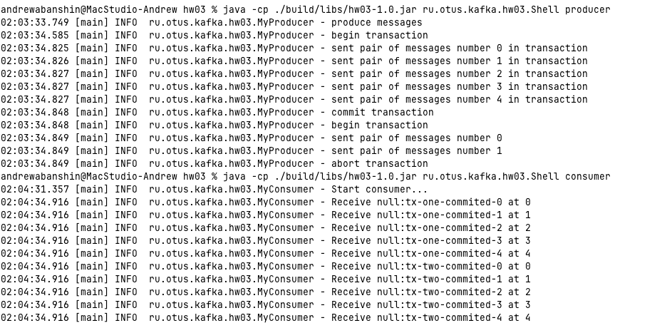

# Домашнее задание

## Разработка приложения с транзакциями

## Цель:
Научиться самостоятельно разрабатывать и запускать приложения с транзакциями.

## Описание/Пошаговая инструкция выполнения домашнего задания:
* Запустить Kafka
* Создать два топика: topic1 и topic2

### Разработать приложение, которое:
* открывает транзакцию
* отправляет по 5 сообщений в каждый топик
* подтверждает транзакцию
* открывает другую транзакцию
* отправляет по 2 сообщения в каждый топик
* отменяет транзакцию

### Разработать приложение, которое будет 
* читать сообщения из топиков topic1 и topic2 так, чтобы сообщения 
из подтверждённой транзакции были выведены, а из неподтверждённой - нет.

# Решение

## Запустить Kafka
```shell 
make up
```

## Компиляция и запуск приложения
```shell
gradle build
java -cp ./build/libs/hw03-1.0.jar ru.otus.kafka.hw03.Shell producer
java -cp ./build/libs/hw03-1.0.jar ru.otus.kafka.hw03.Shell consumer
```


## Остановить кафка
```shell
make down 
```