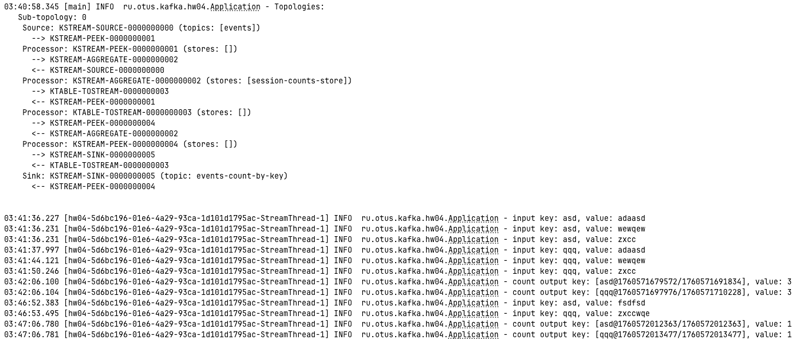

# Домашнее задание

## Разработка приложения Kafka Streams

## Цель:
Разработать приложение Kafka Streams.

## Описание/Пошаговая инструкция выполнения домашнего задания:
Разработка приложения Kafka Streams:

* Запустить Kafka
* Создать топик events
* Разработать приложение, которое подсчитывает количество событий с одинаковыми key в рамках сессии 5 минут
* Для проверки отправлять сообщения, используя console producer

# Решение

## Запустить Kafka
```shell 
make up
```

* Создать топик events
```shell
docker exec hw04-kafka1-1 kafka-topics --create --topic events --bootstrap-server localhost:29092
```
## Компиляция и запуск приложения
```shell
make run
#gradle clean build
#java -cp ./build/libs/hw04-1.0.jar ru.otus.kafka.hw04.Application
```

## Отправка сообщений
```shell
./scripts/produce.sh << !
asd:adaasd
!
sleep 5
./scripts/produce.sh << !
asd:wewqew
!
sleep 5
./scripts/produce.sh << !
asd:zxcc
!
sleep 5
./scripts/produce.sh << !
qqq:adaasd
!
sleep 5
./scripts/produce.sh << !
qqq:wewqew
!
sleep 5
./scripts/produce.sh << !
qqq:zxcc
!
sleep 301
./scripts/produce.sh << !
asd:fsdfsd
!
sleep 5
./scripts/produce.sh << !
qqq:zxccwqe
!

```
**Видим, что по 3 сообщения для каждого ключа обработаны в одно окно, а еще по одному сообшению
обработаны в следующее окно через 5 минут**



## Остановить Kafka
make down 
```