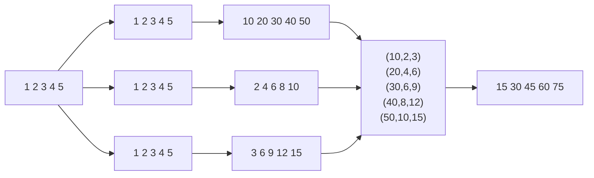

# Домашнее задание
## akka streams, alpakka

## Цель:
Закрепить знания, полученные на занятии.


## Описание/Пошаговая инструкция выполнения домашнего задания:
в репозитории https://github.com/ValentinShilinDe/kafka-mooc-2023-04 есть темплэйт домашней работы
kafka-mooc-2023-04\src\main\scala\akka_akka_streams\homework\homeworktemplate.scala


## Задание из 2-х частей:

1. написать граф дсл, где есть какой-то входной поток (целочисленный), он должен быть разделен на 3 (broadcast).
* Первый поток - все элементы умножаем на 10
* Второй поток - все элементы умножаем на 2
* Третий поток - все элементы умножаем на 3
* Потом собираем это все в один поток (zip), в котором эти 3 подпотока должны быть сложены.



2. (не обязательно, задача со *) входной поток должен идти из кафки 
(то есть написать продьюсер, и в консьюмере реализовать логику 
из пункта 1)

## Решение
 
1) Установить JDK 17
2) Установить Scala  2.13.1
3) Реализовать логику работы с потоками
4) Запустить программу командой 
```sbt
sbt <<< "~runMain homework.Homework"
```
Получаем лог
```log
andrewabanshin@MacStudio-Andrew hw05 % sbt run
[info] welcome to sbt 1.10.5 (Eclipse Adoptium Java 17)
[info] loading settings for project hw05-build from plugins.sbt ...
[info] loading project definition from /Volumes/T9/Otus/OTUSKafka/!Homeworks/hw05/project
[info] loading settings for project root from build.sbt ...
[info] set current project to akka_akka_streams (in build file:/Volumes/T9/Otus/OTUSKafka/!Homeworks/hw05/)
[info] running akka_akka_streams.homework.Homework 
21:28:39.867 [fusion-akka.actor.default-dispatcher-4] INFO akka.event.slf4j.Slf4jLogger - Slf4jLogger started
21:28:40.026 [fusion-akka.actor.default-dispatcher-5] INFO homework - 15
21:28:40.026 [fusion-akka.actor.default-dispatcher-5] INFO homework - 30
21:28:40.027 [fusion-akka.actor.default-dispatcher-5] INFO homework - 45
21:28:40.027 [fusion-akka.actor.default-dispatcher-5] INFO homework - 60
21:28:40.028 [fusion-akka.actor.default-dispatcher-5] INFO homework - 75
[success] Total time: 1 s, completed 19 окт. 2025 г., 21:28:40
```

5) Запустить программу командой
```sbt
sbt <<< "~runMain alpakka.ProducerApp"
sbt <<< "~runMain alpakka.ConsumerApp"  
```

```log
....
>....[info] running alpakka.ConsumerApp 
01:51:31.243 [fusion-akka.actor.default-dispatcher-4] INFO akka.event.slf4j.Slf4jLogger - Slf4jLogger started
01:51:31.370 [consumer-sys-akka.actor.default-dispatcher-4] INFO akka.event.slf4j.Slf4jLogger - Slf4jLogger started
Start ConsumerApp
[success] Total time: 1 s, completed Nov 24, 2025, 1:51:31 AM
[info] 1. Monitoring source files for root/runMain alpakka.ConsumerApp...
[info]    Press <enter> to interrupt or '?' for more options.
15
30
45
60
75
```